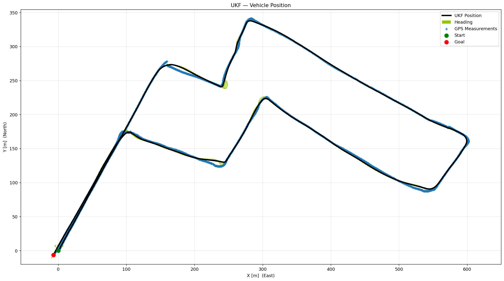
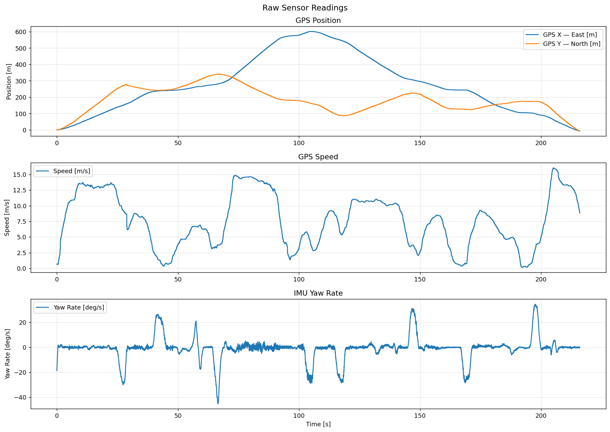
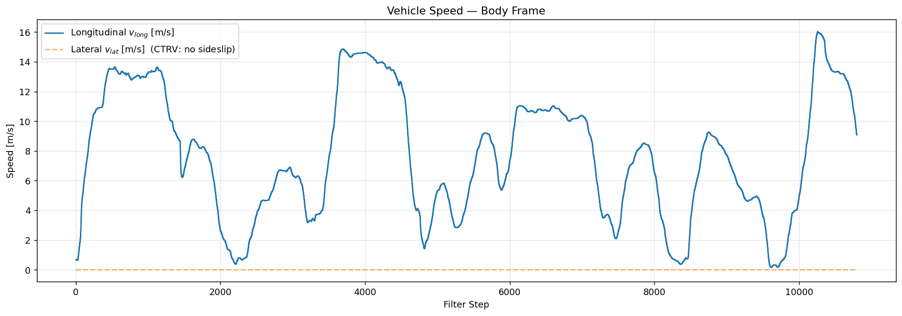
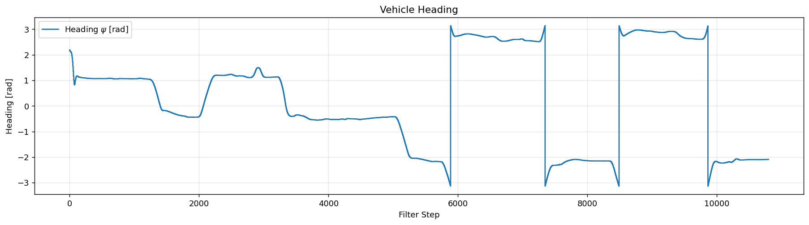

# Unscented Kalman Filter for Vehicle Localization

An Unscented Kalman Filter that fuses GPS and IMU data to estimate the position,
heading and velocity of a moving vehicle, implemented with **four interchangeable sigma
point algorithms** behind a single interface.

The sigma point classes and the UKF predict/update equations are based on Roger Labbe's
[`filterpy`](https://github.com/rlabbe/filterpy), adapted here into a small self-contained
module that depends only on NumPy and SciPy.



> Black: the UKF position estimate. Blue: the raw GPS fixes. Green: estimated heading,
> sampled every 20th step. Roughly 600 m of driving, 216 s, 10,800 filter steps.

---

## Why this problem

GPS gives you absolute position, but at a fraction of the IMU's rate, and it drops out
entirely under bridges and in tunnels. An IMU gives you speed and yaw rate at 50 Hz, but
integrating it drifts without bound. A Kalman filter fuses both. The catch is that the
CTRV motion model is **nonlinear**, so the standard linear Kalman filter does not apply.

The Unscented Kalman Filter handles this by propagating a deterministic set of *sigma
points* through the nonlinear model and recovering the posterior mean and covariance
from them, avoiding the Jacobians an EKF would require.

## The model

**State**: Constant Turn Rate and Velocity (CTRV), 5 dimensions:

```
x = [ x_pos, y_pos,    ψ,      v,     ψ̇    ]
      East   North  heading  speed  yaw rate
      [m]     [m]    [rad]   [m/s]  [rad/s]
```

**Transition** (`Fx` in `ukf.py`) integrates CTRV in closed form, with a separate
straight-line branch when `|ψ̇| < 1e-4` to avoid dividing by a near-zero turn rate.

**Measurement**: the filter switches between two observation models depending on
whether a GPS fix arrived this step:

| Condition | Measured | `Hx` |
|---|---|---|
| GPS fix available | `[x, y, v, ψ̇]` | `Hx_gps` |
| GPS dropout | `[v, ψ̇]` | `Hx_nogps` |

In this log the IMU samples at 50 Hz while a new GPS fix lands at about 10 Hz, so
**80% of the 10,800 filter steps run without a position measurement**. Those steps still
update the filter, which dead-reckons on IMU alone while the position covariance grows,
then snaps back when the next fix arrives.

## The four sigma point sets

All four expose the same `sigma_points(x, P)` / `Wm` / `Wc` / `num_sigmas()` interface,
so swapping one for another is a one-line change. For this 5-state problem:

| Method | Points (n=5) | Weights | Reference |
|---|---|---|---|
| `merwe` | 11 | α/β/κ scaled, distinct `Wm`/`Wc` | Van der Merwe (2004) |
| `julier` | 11 | κ-scaled, `Wm == Wc` | Julier & Uhlmann (1997) |
| `simplex` | 6 | uniform | Moireau & Chapelle (2011) |
| `spherical_radial` (cubature, CKF) | 10 | uniform `1/2n` | Arasaratnam & Haykin (2009) |

The simplex set is the minimal one (`n+1` points), giving about **45% fewer model
propagations per step** than the symmetric sets, which matters on embedded targets. The cubature set
drops the centre point entirely and uses equal weights, which keeps the covariance update
positive semi-definite without tuning α, β or κ.

## Implementation notes

A few details that are easy to get wrong and are handled deliberately here:

- **Heading is circular.** `ψ` lives on `[-π, π]`, so a naive weighted mean of sigma
  points straddling the ±π branch cut is meaningless. Rather than wrapping each sigma
  point inside `Fx`, which destroys the centroid property the weighted sum relies on, the
  mean is taken arithmetically and wrapped **once**, and every `x_i − x̄` residual is
  wrapped before entering the covariance sum. See the comment block in `ukf_predict`.
- **Covariance symmetry.** `P` is re-symmetrised (`0.5·(P + Pᵀ)`) after both the predict
  and update steps to stop floating-point asymmetry from accumulating and eventually
  breaking the Cholesky factorisation.
- **Coordinate conversion.** GPS lat/lon is projected to local East/North metres via an
  altitude-corrected arc length, and the GPS course convention (0° = North, clockwise) is
  converted to the mathematical convention (0° = East, counter-clockwise).

## Repository layout

```
sigma_points.py    The four sigma point algorithms, common interface
ukf.py             CTRV model (Fx), measurement models (Hx), predict/update steps
plots.py           Result figures: raw sensors, speed, heading, yaw rate, XY track
main.py            Data loading, tuning parameters, filter loop, entry point
requirements.txt   Runtime dependencies
```

## Running it

```bash
git clone https://github.com/luisfmaroso/UnscentedKalmanFilter
cd UnscentedKalmanFilter
pip install -r requirements.txt
```

The vehicle log is not vendored here, since it belongs to another project. Download it
into `data/`:

```bash
mkdir -p data
curl -L -o data/2014-03-26-000-Data.csv https://raw.githubusercontent.com/balzer82/Kalman/master/2014-03-26-000-Data.csv
```

Then run:

```bash
python main.py
```

To switch sigma point algorithms, change the constant at the top of `main.py`:

```python
SIGMA_METHOD = 'merwe'   # 'merwe' | 'julier' | 'simplex' | 'spherical_radial'
```

The process noise `Q` and the two measurement noise matrices `R_gps` / `R_nogps` are
defined just below it, alongside the `dt = 1/50 s` sample interval.

## Results

`main.py` produces five figures. The estimated track is at the top of this README; the
sensor inputs and the remaining state estimates are below.

**Raw sensor inputs**: GPS position, GPS speed and IMU yaw rate, before filtering:



**Estimated speed and heading**. CTRV assumes no lateral slip, so `v_lat` is zero by
model definition:





## Credits

The sigma point algorithms and the UKF predict/update equations are based on
[`filterpy`](https://github.com/rlabbe/filterpy) by Roger R. Labbe Jr, licensed MIT.
`filterpy` is not a runtime dependency; the relevant parts are reimplemented here on
NumPy and SciPy so the filter stays a small, readable module.

The vehicle log (`2014-03-26-000-Data.csv`) is from
[balzer82/Kalman](https://github.com/balzer82/Kalman), licensed
CC-BY-SA 2.0. It is not redistributed in this repository. The command above fetches it
from the original source.
